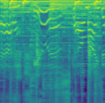
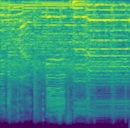
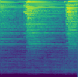
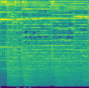
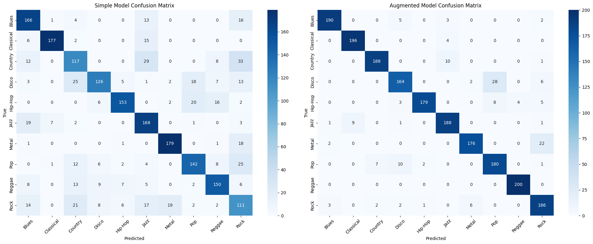

# GenreGenie

## Descripcción

GenreGenie es un clasificador de géneros musicales basado en el aprendizaje automático. Utiliza un modelo de red neuronal para predecir el género de una canción a partir de sus características de audio.

## DataSet

El dataset utilizado para entrenar el modelo es el [GTZAN Genre Collection](https://www.kaggle.com/code/dapy15/music-genre-classification#Classifier), que contiene 1000 canciones de 10 géneros diferentes. Cada género tiene 100 canciones de 30 segundos de duración.

Los géneros son:

- Blues
- Classical
- Country
- Disco
- Hip-Hop
- Jazz
- Metal
- Pop
- Reggae
- Rock

El data set fue utilizado para generar 10 [espectrogramas](#espectogramas) de 3 segundos de cada canción. Por lo tanto, el dataset contiene 1000 espectrogramas de cada género, lo que da un total de 10,000 espectrogramas.

Ejemplos de spectrogramas generados:

## División del dataset

El dataset se divide en un 60% para entrenamiento, 20% para validación y 20% para prueba, manteniendo uniformidad entre los géneros. Esta división se realizó de manera aleatoria al momento de generar los espectrogramas.

# Aumentación de datos

Para mejorar la robustez del modelo, se aplicó una técnica de aumentación de datos. Se utilizó audio streching, que consiste en cambiar la velocidad de reproducción del audio sin alterar su tono. Esta técnica permite generar variaciones del audio original, lo que ayuda a entrenar un modelo más robusto y capaz de generalizar mejor a nuevos datos [[2]](#referencias).

Se aplicó un factor de estiramiento de 0.85 y 1.15 a cada canción del dataset de entrenamiento[[2]](#referencias). Esto significa que algunas canciones se reproducen más lentamente y otras más rápido, lo que genera variaciones en el audio sin cambiar su tono.

Se guardaron los espectrogramas generados por la aumentación de datos en una carpeta separada "AugmentedSpectrograms". Lo cual nos permite comparar el rendimiento del modelo con y sin aumentación de datos.

# Espectogramas

Los espectrogramas son representaciones visuales de la frecuencia y la amplitud de una señal de audio a lo largo del tiempo. En este proyecto, se utilizan espectrogramas para representar las características de audio de las canciones y entrenar el modelo de red neuronal.

### Espectogramas Mel

Los espectrogramas Mel son una representación de la frecuencia de una señal de audio en la escala Mel, que es una escala logarítmica que se asemeja a la percepción humana del sonido. Esta representación es útil para el reconocimiento de patrones en señales de audio.

Se emplea la librería [librosa](https://librosa.org/doc/main/index.html) para generar los espectrogramas Mel. La función `librosa.feature.melspectrogram` se utiliza para calcular el espectrograma Mel a partir del audio.

Los parámetros utilizados para generar los espectrogramas Mel son:

- `SampleRate`: 22050 Hz

Define cuantos datos se toman por segundo. 22050 Hz es un estándar común para capturar los detalles del audio sin incluir el ruido de alta frecuencia.

- `n_mels`: 128

Define el número de bandas Mel. Las cuales se utilizan para representar la frecuencia de la señal de audio. 128 es un valor comúnmente utilizado que proporciona un buen equilibrio entre la resolución temporal y la frecuencia.

- `Duracion del segmento`: 3 segundos

Se utilizaron segmentos de igual duración para la extracción de características MFCC y en modelos como CNN y XGBoost. Se observó que la segmentación de datos puede mejorar el rendimiento, especialmente en las CNN [[1]](#referencias).

## Modelo

Para nuestro modelo se utilizo una arquitectura de CNN basada en la propuesta de Meng [[1]](#referencias). La arquitectura consta de varias capas convolucionales y de agrupamiento, seguidas de capas densas para la clasificación final.

Como entrada el modelo recibe un spectograma a color de 128x130 pixeles, y 3 canales de color (RGB).

Se utilizan 3 bloques convolucionales parecidos, que cuentan con:

- **Conv2D**: Capa convolucional que aplica filtros para extraer características espaciales del espectrograma. Cada filtro está diseñado para detectar patrones básicos (como bordes, ciertas texturas o gradientes de color en el espectrograma). Las cuales van aumentando la cantidad de filtros a medida que se avanza en la red, comenzando con 32 filtros y aumentando hasta 128.

- **MaxPooling2D**: Reduce la altura y anchura de los mapas de características a la mitad. Esto tiene como objetivo reducir la dimensionalidad de los datos obteniendo las características más importantes.

- **BatchNormalization**: Normaliza la salida de la capa anterior ayudando a estabilizar y acelerar el entrenamiento del modelo.

- **Dropout**: Se utiliza para prevenir el sobreajuste del modelo. Desactivando un porcentaje de las neuronas durante el entrenamiento

### Optimizador

Para el optimizador se utilizó Adam, que es un algoritmo de optimización que ajusta la tasa de aprendizaje para cada parametro del modelo.

Para el loss se utilizó `sparse_categorical_crossentropy`, que compara las predicciones del modelo con las etiquetas reales y calcula la pérdida.

## Metricas

Para evaluar el rendimiento del modelo, se utilizan las siguientes métricas:

- **Accuracy**: Mide la proporción de predicciones correctas sobre el total de predicciones realizadas.

## Comparación de resultados de los modelos

Se entrenaron 2 modelos, uno con aumentación de datos y otro sin aumentación de datos. A continuación se presentan los resultados de test obtenidos:

| Modelo                   | Accuracy | Loss |
| ------------------------ | -------- | ---- |
| Sin aumentación de datos | 0.74     | 0.97 |
| Con aumentación de datos | 0.92     | 0.81 |

#### Matriz de confusión

El modelo con aumentación de datos tiene un mejor rendimiento teniendo un aumento de alrededor del 18% en la precisión en los datos de prueba.

Se puede observar en la matriz de confusión que los géneros que más confunde el modelo son el "disco" con "pop" además de "metal" con "rock". Los cuales son generos con características similares. 

## Referencias

[1] Y. Meng, “Music Genre Classification: A Comparative Analysis of CNN and XGBoost Approaches with Mel-frequency cepstral coefficients and Mel Spectrograms,” arXiv (Cornell University), Jan. 2024, doi: https://doi.org/10.48550/arxiv.2401.04737.

[2] T. Ko, V. Peddinti, D. Povey, and S. Khudanpur, “Audio augmentation for speech recognition,” Interspeech 2015, Sep. 2015, doi: https://doi.org/10.21437/interspeech.2015-711.
